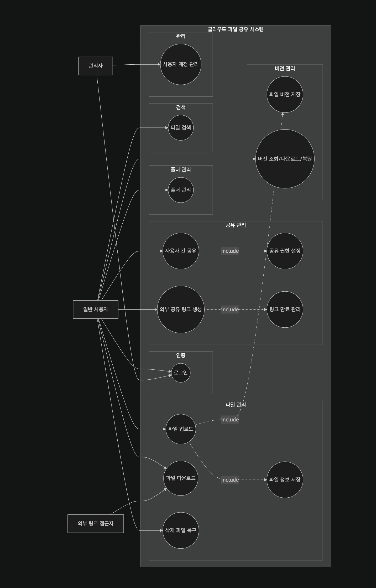
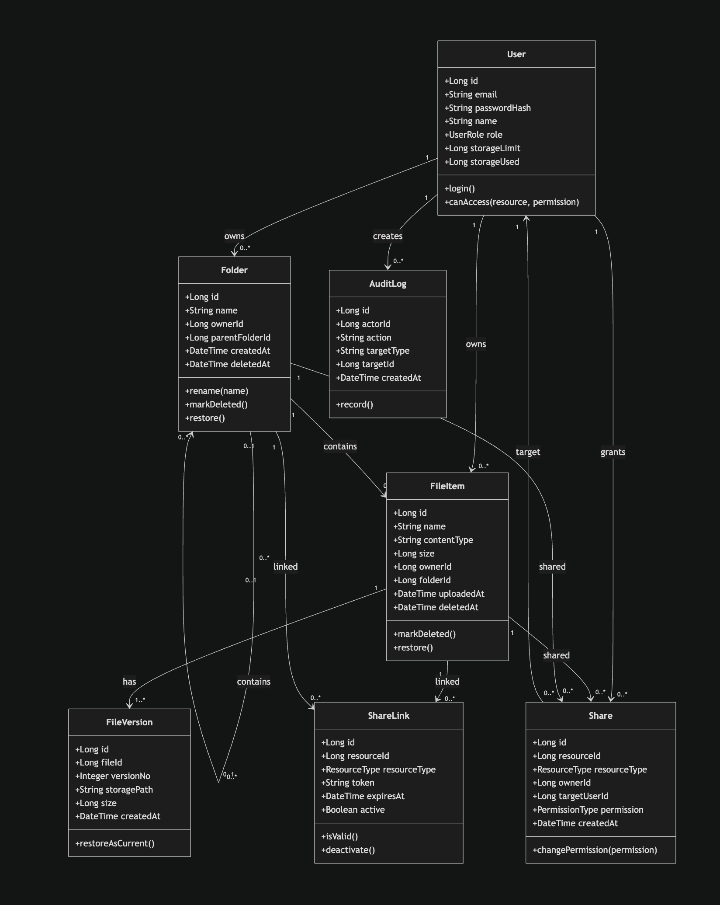
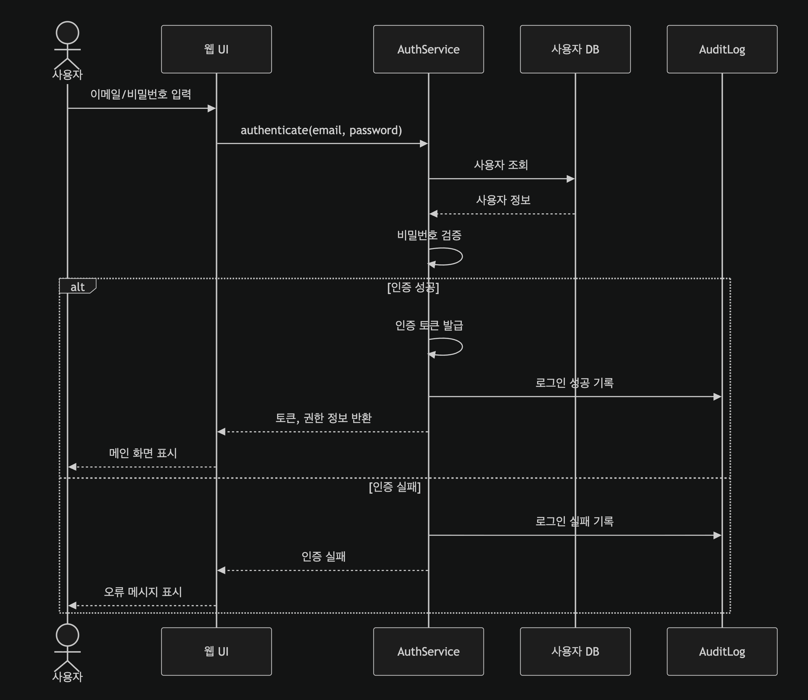
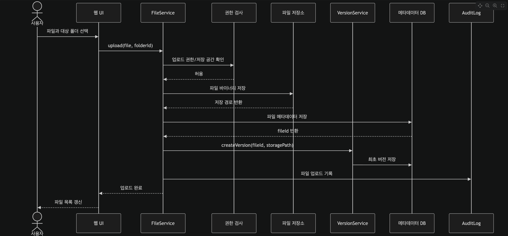
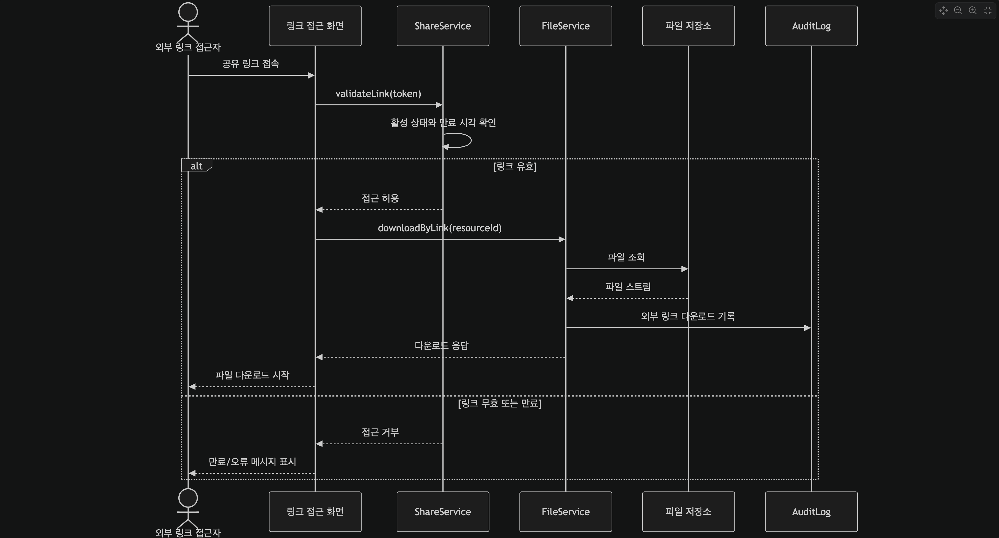

# 요구사항 분석서

대상 시스템: 클라우드 파일 공유 시스템(미니 드라이브)

## 1. 기능 관점 — 유스 케이스

### 1.1 유스 케이스 다이어그램

### 1.2 유스 케이스 설명서

#### UC-01 로그인

| 항목      | 내용                                                                               |
| --------- | ---------------------------------------------------------------------------------- |
| 행위자    | 사용자                                                                             |
| 사전 조건 | 계정이 등록되어 있다.                                                              |
| 기본 흐름 | 1. 이메일/비밀번호 입력 → 2. 시스템이 검증 → 3. 인증 토큰 발급 → 4. 메인 화면 표시 |
| 예외 흐름 | 인증 실패 시 오류 메시지 표시.                                                     |
| 사후 조건 | 사용자 세션이 생성된다.                                                            |

#### UC-02 파일 업로드

| 항목      | 내용                                                                                   |
| --------- | -------------------------------------------------------------------------------------- |
| 행위자    | 사용자                                                                                 |
| 사전 조건 | 로그인되어 있다.                                                                       |
| 기본 흐름 | 1. 파일 선택 → 2. 시스템이 저장소에 저장 → 3. 메타데이터/최초 버전 기록 → 4. 결과 표시 |
| 예외 흐름 | 저장 공간 부족 시 업로드 거부.                                                         |
| 사후 조건 | 파일과 최초 버전이 저장된다.                                                           |

#### UC-03 파일 다운로드

| 항목      | 내용                                                |
| --------- | --------------------------------------------------- |
| 행위자    | 사용자, 외부 접근자                                 |
| 사전 조건 | 사용자는 로그인, 외부 접근자는 유효 링크 보유.      |
| 기본 흐름 | 1. 다운로드 요청 → 2. 권한/링크 검증 → 3. 파일 반환 |
| 예외 흐름 | 권한 없음 또는 링크 만료 시 거부.                   |
| 사후 조건 | 파일이 사용자에게 전송된다.                         |

#### UC-04 파일 공유

| 항목      | 내용                                                                                      |
| --------- | ----------------------------------------------------------------------------------------- |
| 행위자    | 사용자                                                                                    |
| 사전 조건 | 대상 파일에 대한 공유 권한이 있다.                                                        |
| 기본 흐름 | 1. 공유 방식(사용자 지정/외부 링크) 선택 → 2. 권한 또는 만료 기간 설정 → 3. 시스템이 저장 |
| 예외 흐름 | 대상 사용자가 없거나 권한이 부족하면 거부.                                                |
| 사후 조건 | 공유 정보 또는 링크가 생성된다.                                                           |

#### UC-05 파일 검색

| 항목      | 내용                                                            |
| --------- | --------------------------------------------------------------- |
| 행위자    | 사용자                                                          |
| 사전 조건 | 로그인되어 있다.                                                |
| 기본 흐름 | 1. 검색어/조건 입력 → 2. 접근 가능 범위로 필터링 → 3. 결과 표시 |
| 예외 흐름 | 결과 없음 시 안내 메시지 표시.                                  |
| 사후 조건 | 접근 권한이 있는 파일만 반환된다.                               |

## 2. 구조 관점 — 클래스 다이어그램

## 3. 행위 관점 — 순차 다이어그램

### 3.1 로그인

### 3.2 파일 업로드

### 3.3 외부 공유 링크 다운로드

